# Jujutsu — Gojo Satoru, Kinji Hakari, Yuji Itadori, Yuta Okkotsu and Ryu Ishigori

Fabric mod for **Minecraft 26.3** (Java 25, Fabric API). Install the jar plus Fabric API. The latest build is
[`release/jujutsu-0.1.0.jar`](release/jujutsu-0.1.0.jar).

## Controls

The Jujutsu Shenanigans PC layout. In combat mode 1-4, Q and F belong to the mod (the hotbar, drop and offhand swap on
those keys are held back); Vanilla Minecraft mode gives them back. Everything can be rebound in Controls.

| Key | Base Gojo | Six Eyes (awakened) |
|---|---|---|
| Left click | M1 chain · hold = charged heavy (always the M1 in combat mode, whatever you hold; it never mines) | same |
| 1 | Lapse Blue | **Lapse Blue MAX** (hold to steer) |
| 2 | Reversal Red | **Reversal Red MAX** |
| 3 | Rapid Punches | **Hollow Purple** |
| 4 | Twofold Kick | **Infinite Void** |
| R | Limitless (Special) | Limitless |
| G | **Awakening** (meter full) · the domain counter | counter |
| F | Block (hold; tap early = parry) | same |
| Q | Dash · ragdoll escape while ragdolled | same |
| W W | Sprint (Minecraft's double tap) | same |
| Space | Jump | same |
| *(unbound)* | Combat / Vanilla Minecraft mode | same |

Melee variations: click in the air for air combos, hold jump on the 4th hit for an uppercut, click while sprinting for a
lunge, look down at a knocked-down enemy for a stomp.

### Satoru Gojo — Honored One

Tuned after the [Jujutsu Shenanigans wiki](https://jujutsu-shenanigans.fandom.com/wiki/Honored_One) (the `gojo`,
`red`, `maxBlue`, `maxRed` and `purple` config sections).

- **Lapse Blue** (13s): aimed at someone within 35 studs, a vacuum pulls them in (5), suspends them in front of Gojo —
  who gains melee i-frames — and he follows with an unblockable kick (7.5). Blocking stops the pull.
- **Reversal Red** (20s): a short wind-up, then an orb that flies 40 studs and bursts in a 15-stud blast (12.5; half,
  with no knockback and never fatal, through a guard). Limitless during the wind-up: he phases behind the target, upside
  down, for a point-blank Red; on an airborne target he kicks first (5 + 12.5); on a target caught mid-move or mid-dash
  they freeze and he calls "Aka" before an enhanced orb (15).
- **Rapid Punches** (15s): a spinning kick locks a nearby enemy (it can't catch a ragdoll); bullet i-frames, 15 punches,
  3 heavy punches, then a final blow that ragdolls them — nearly twice as far if they had just got up. Limitless right
  after it lands is **Face Grater**: he appears before them, drags them along the floor and tosses them (10.2).
- **Twofold Kick** (18s): a rising kick (a guard stops the rest); melee i-frames and an unblockable second kick that
  bounces them higher.
- **Limitless** (Special, 15s, 6% of the meter in the base kit): hand up, the glass shatters, and he is right in front
  of the target under the crosshair; turn the camera during the wind-up to choose where around them. Airborne target:
  he appears over them and kicks them to the floor (8).
- **Six Eyes** (G on a full meter): the blindfold comes off, 25% health back, 60 seconds of Awakening.
  **0.2 Domain**: press R during the Awakening sequence. Infinite Void for two tenths of a second — every enemy in a wide
  range is overloaded for 7 seconds — then a three-phase rush (7×5, 6×20, 65) with i-frames during each run. Two
  targets held at the end are both finished. Afterwards he is burnt out: base kit, all on cooldown except Limitless.
- **Lapse Blue MAX** (17s): a steerable vortex (hold to guide it; walk or hang in the air meanwhile), 20 ticks of 2.2.
  If it kills someone it lingers and keeps pulling everyone else in at half damage.
- **Reversal Red MAX** (10s): a little over a second of charge, then a piercing orb for 100 studs, 30 falling to 7 with
  distance. Airborne: he hovers and aims freely. Limitless during the charge (free): it rebounds to him — a target it
  caught is pulled in for a Black Flash (10), an empty return hits Gojo (15).
- **Unlimited Purple**: Red MAX into the orb Lapse Blue MAX left behind after a kill. Three seconds later it erases
  everything within 48 blocks (three times its old 16: the dome, the damage, the knockback and the crater all follow
  that one radius; 50-100 by distance) and drains the whole Awakening. The crater is carved outward over a few ticks
  within the per-tick block budget. It plays like the JJS GIF:
  1. A black impact frame as Red tears into the orb, magenta flares streaking across the view, and the world lit magenta.
  2. The orb's dark-blue ink turns magenta around a swelling white-hot core. Lightning crackles out across the whole
     blast radius, and a pink dome marks what it will erase.
  3. A dark shell collapses in onto the core.
  4. The detonation whites out everything near it, then pink sparkles drift up out of the crater.
- **Hollow Purple** (40s): Blue and Red combine and it rushes forward about three seconds in (70, unblockable, erases
  blocks); airborne he hovers with free aim. Blue crackles with lightning in one hand while red wind whips round
  the Red in the other. As they meet, magenta lightning lashes out, and the mass (a white-hot core in a ragged ring
  of dark magenta) is held, then fired.
- **Infinite Void** (4 while awakened, 120s): the domain below, 14 seconds; everyone caught is stunned until it ends.
- **Finishers** (under 20% health): Lapse Blue crushes them in rubble, Red shatters them, Rapid Punches ends in a Black
  Flash, Twofold Kick holds them up for a point-blank Red.

**Infinite Void** builds a real, sealed dome of blocks (walls, ceiling, floor and underground shell) around the fight for
14 seconds. Everything it replaces (including chest contents, block states, waterlogging) is saved to disk first and
restored exactly afterwards. The barrier can't be mined, blown up or pushed. If the server stops or crashes mid-domain,
the world is restored on the next start.

## Characters

Press **K** (or pause menu → *JJK Settings* → *Choose Character...*) to open the character select screen and click a
card. Every registered character gets a card from its own name, title, description, theme and portrait, so adding a
character never touches the screen. Switching only works from a neutral state: not mid-attack or mid-cast, not
awakened or in Jackpot, not in or near a domain or clash, not stunned, and not hit in the last few seconds. The old
kit's techniques, toggles and states are cleared and the new moveset, HUD icons and theme load at once.

| Key | Gojo (Honored One) | Hakari (Restless Gambler) | Hakari in Jackpot | Yuji (Vessel) | King of Curses |
|---|---|---|---|---|---|
| 1 | Lapse Blue | Reserve Balls | Lucky Volley | Cursed Strikes | Dismantle |
| 2 | Reversal Red | Shutter Doors | Lucky Rushdown | Crushing Blow | Open |
| 3 | Rapid Punches | Rough Energy | Overwhelming Luck | Divergent Fist | Rush |
| 4 | Twofold Kick | Fever Breaker | Energy Surge | Manji Kick | Malevolent Shrine |
| R (Special) | Limitless | Door Guard (hold) | Rhythm | Combat Instincts | Cleave |
| G | Awakening (Six Eyes) | Idle Death Gamble | — | Awakening (King of Curses) | counter |

Yuta has four movesets: his own and Rika's, each in base and awakened form. R with Rika out switches between his and
hers.

| Key | Yuta (Cursed Partners) | Rika | True Love (awakened) | Awakened Rika |
|---|---|---|---|---|
| 1 | Severing Path | Rika Smash | Elbow Rush | Rika Downslam |
| 2 | Resolute Slash | Rika Launch | Copy | Rika Slam |
| 3 | Outburst (hold) | Rika Haymaker | Energy Ripple | True Love Beam |
| 4 | Second Wind | — | Authentic Mutual Love | Rika Throw |
| R (Special) | Rika | Rika (back to Yuta) | Rika | Rika (back to Yuta) |
| G | Awakening (True Love) | True Love | Copy Wheel | Copy Wheel |

Ryu has his base kit and Decadence, the awakened kit Every Last Drop can give him.

| Key | Ryu (True Cannon) | Decadence (awakened) |
|---|---|---|
| 1 | Granite Blast (hold) | "What are you after?" |
| 2 | Unsatisfied | "I had no idea..." |
| 3 | Second Helping | "This is what dessert is like!" |
| 4 | Appetizer | "You weren't invited." (hold) |
| R (Special) | Restyle | Restyle |
| G | Every Last Drop | — |

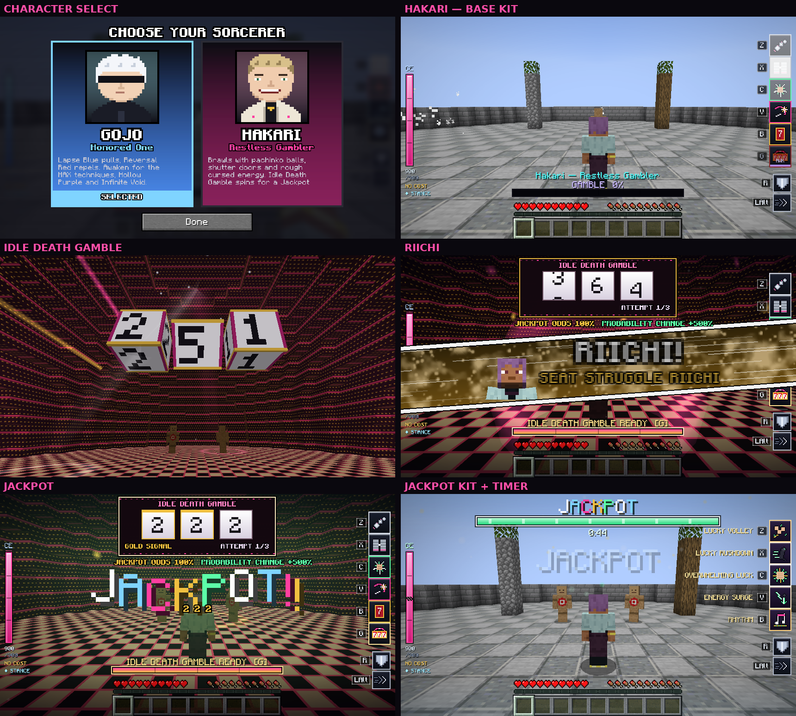
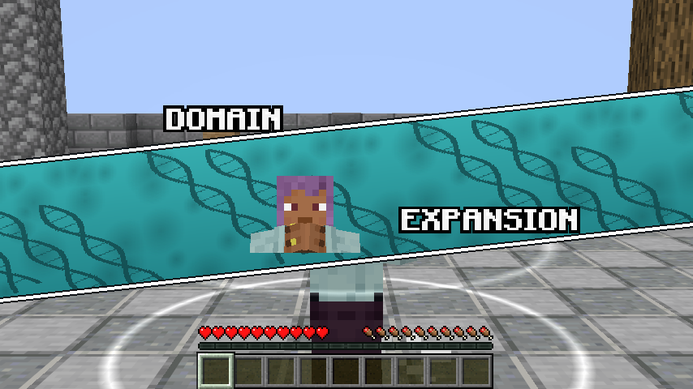
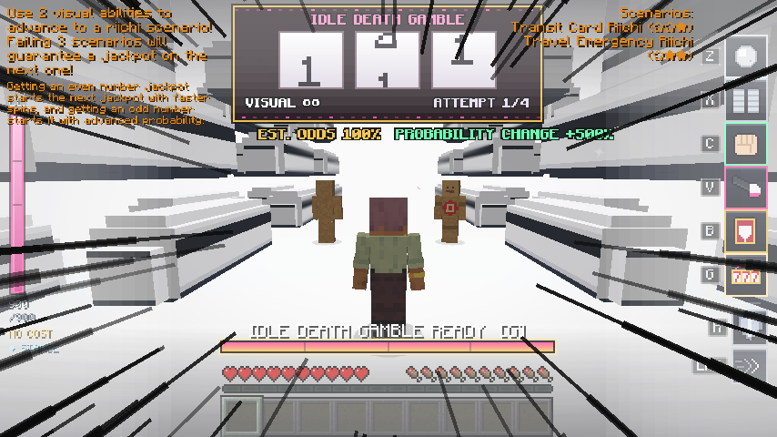
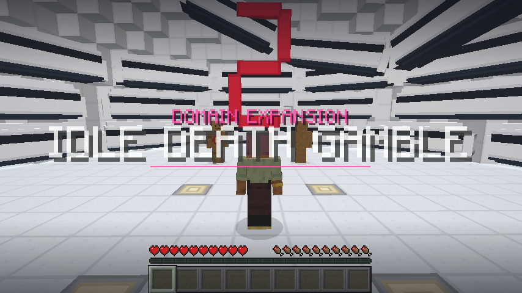

### Kinji Hakari — Restless Gambler

Tuned after the [Jujutsu Shenanigans wiki](https://jujutsu-shenanigans.fandom.com/wiki/Restless_Gambler): the wiki's
cooldowns and durations, its studs as blocks (about 3.6 studs to a block), all in the `hakari` section of the config.

- **Reserve Balls** (12s): one steel ball flicked about 65 studs, ricocheting off surfaces while it has distance left
  (much further inside his domain). It stuns whoever it hits, or ragdolls them if it hit within 15 studs.
  *Shutter Doors during the wind-up*: the doors manifest where the ball lands and bounce a target it stunned.
- **Shutter Doors** (15s): two grey doors flash into being, drop flat onto the floor either side of the target from up to
  25 studs away and slide shut under them (Door Guard's double door and Fever Breaker's are the ones that stand up). The target is stunned and Hakari's melee chain jumps to its 3rd hit. Doors that catch nobody
  linger for 7 seconds: jump on them to bounce high (they shatter), and a ragdolled enemy falling on them bounces three
  times, taking damage each time.
- **Rough Energy** (14s): a long wind-up, then an unblockable punch that sends them flying. *In the air*: a short
  hover, then a stomp whose shockwave launches everyone around upward. *From higher than a jump*: the stomp is
  unblockable and does double damage.
- **Fever Breaker** (23s): a reaching kick suspends the target in front of two shutter doors, then a dropkick launches
  them wherever Hakari is facing. *Fever Crush* (Shutter Doors during the wind-up): the doors clamp them while he
  raises his foot, and an unblockable axe kick crushes them. On a ragdolled target the axe kick does double damage and
  shatters the doors, unless he looks slightly away from them to keep them standing.
- **Door Guard** (Special, hold; 16s): a melee hit in the first 0.6s is answered with a punch through the doors that
  repels the attacker. A bullet (projectile) only shatters the doors.
- **Idle Death Gamble** (full Awakening meter; 80s, heals 15% on cast, invincible through the hand sign), presented
  the way Jujutsu Shenanigans does it:
  - **The opening**: a white slash cuts across the screen and opens into a teal band patterned with double helices,
    Hakari's close-up in it and "DOMAIN" / "EXPANSION" on its edges. White smoke bursts off him, white floods out over
    the ground from his feet with ink splashing along its edge (the real domain building), and everything goes white as
    it seals. Everyone inside then rushes through a tunnel of train cars with black speed lines, until the cars
    tumble away.
  - **The room**: endless glowing white. Floor, walls and ceiling are the same flat, self-lit white, with no shading,
    no ambient occlusion and no shadows, and the view blooms white at its edges, so there is no depth to judge by. Only
    the train-car kiosks standing about the floor, and the people in it, stand out. The giant red seven-segment
    counters and a winding train appear for each Riichi.
  - **The rules** stay on screen for everyone inside, their colour cycling: how to reach a Riichi, the pity jackpot and
    the odd/even bonuses top left, the scenarios top right. Everyone caught is frozen in place while they appear; the
    sure-hit does no damage.
  - **Visual moves**: using Reserve Balls or Shutter Doors (the two combined count twice), landing Fever Breaker's
    dropkick, Fever Crush, or a successful Door Guard. Two of them start a **Riichi**.
  - **Riichi**: Transit Card (one star) or Travel Emergency (two stars, better odds). A cut-in plays, the first two
    reels lock and the third spins down.
  - **Four attempts**: a miss goes back to spinning. The fourth scenario is a guaranteed **pity jackpot** with half
    the usual Jackpot time, as long as someone was caught in the domain; without one the domain breaks after it.
  - **Bonuses**: an odd jackpot number gives the next domain better odds, and an even one makes its Riichi scenarios
    play twice as fast. Both are lost on death.
  - **Renewal**: inside the domain, pressing Reserve Balls again within 8 seconds of a ball landing rewinds to that
    moment. Everyone goes back where they stood, and any damage Hakari took since is undone.
- **Jackpot** (100s, or 50s after a pity jackpot): infinite cursed energy, and a Reverse Cursed Technique that runs on
  its own. He is essentially immortal: every hit he survives is healed instantly, back to full; only a single blow
  big enough to kill him from full health ends him. Damage still drains the Jackpot meter (empty after 3.33 times his
  max health). Surviving to the end refunds 40% of the Awakening meter, and 25% more for each Jackpot in a row. Missing
  a jackpot or dying resets that. The kit becomes:
  - **Lucky Volley** (10s): a flurry of punches he can walk forward, ending in an unblockable swipe that launches them.
  - **Lucky Rushdown** (15s): a long run; whoever he meets is grabbed by the leg, dragged and thrown. Unblockable.
  - **Overwhelming Luck** (20s): a rushing strike that tosses them, then he sprints after them, grabs everyone it
    caught and finishes with a string of hits and a final punch. Unblockable.
  - **Energy Surge** (25s): a dash punch launches them skyward, and he blinks up and kicks them down.
  - **Rhythm** (8s): he does his dance — arms spread wide, shifting his weight side to side on each beat, a V to finish. Finish the dance uninterrupted to get a stacking speed boost to his moves
    and special, and every cooldown finishes 0.6s sooner.
- **Finishers**: on a target at 20% health or less, Shutter Doors shut them in completely, Lucky Volley's swipe sends
  them flying, and Lucky Rushdown drags them further, hurls them into the air and ends with a leaping punch.

### Yuji Itadori — Vessel

Tuned after the [Jujutsu Shenanigans wiki](https://jujutsu-shenanigans.fandom.com/wiki/Vessel) and its GIFs: the wiki's
damage, cooldowns and durations, studs as blocks, move timings from the GIFs (the `yuji` section of the config). Every
sound is the JJS audio. 85 max HP.

- **Cursed Strikes** (14s): eyes glowing red, he slides forward; whoever he meets eats a flurry of punches (bullet
  i-frames) and a calf kick that stuns them in place. His M1 count carries over and his front dash is shut off for a
  moment. A guard cuts the slide short; 360 blockable; can't bypass ragdoll. *In the air*: a hop, then a dropkick diving
  at the ground that grounds whoever it lands on (unblockable). *Finishers*: a kick, the floor struck to launch them, a
  spin kick; in the air, a Black Flash on landing.
- **Crushing Blow** (15s): cursed energy charges in his hand; a target close enough is grabbed, slammed twice and flung
  skyward; nobody close and the floor takes it (a shockwave that catches people getting up). *In the air*: he dashes
  across the air at them first. *Finisher*: one slam, then a German suplex.
- **Divergent Fist** (18s): a blow, then the cursed energy lagging behind it launches them a beat later (a stun instead
  if it interrupts what they were doing). **Black Flash**: press it again while his body flashes white (the cast bar
  reads BLACK FLASH!). **Black Flash Chain**: a Black Flash on someone's back stuns them and keeps Divergent Fist off
  cooldown; up to four in a row, the fourth a heavy one ("KOKUSEN"), and his side dash comes back after each. Each link
  is a punch, an uppercut or a dropkick at random, and the last one's launch follows it (away, skyward or far).
  *Finishers*: the body shatters; a finishing Black Flash sends them extremely far.
- **Manji Kick** (20s): 0.6s counter stance. A melee hit is answered with an upward roundhouse to the side; a bullet is
  dodged and he swoops in on the shooter. *Finisher*: a leg lock, a spin and a slam that crushes them.
- **Combat Instincts** (Special, 2s): during an M1's or a move's wind-up (not Manji Kick) it cancels it with no endlag
  and keeps the move off cooldown; with the aerial variants the hop is kept for mobility. Takes 3% Awakening if there
  is any. Next to a throwable (barrel, composter, anvil, bookshelf...) it punches the prop across the field for 15
  (needs the 3%).
- **King of Curses** (full meter; 60s, heals 45 HP): he faints and Sukuna takes over — "You're such an annoying brat,"
  the marks and the second pair of eyes on his face, a red aura. **Shrine**: his M1s become slashes reaching three
  times as far (24 studs), 360 blockable, cutting through walls, with no uppercut or downslam.
  - **Cleave** (Special, 12s): a grab, a pause, then a storm of slashes: 40% of their current health, at least 10.
  - **Dismantle** (13s): a barrage of slashes on whoever he faces within 30 studs (17.5; 10 through a guard, which also
    can't be finished by it). *In the air*: a flip and one long unblockable slash down the line.
  - **World Cutting Slash**: Rush during Dismantle's wind-up, then Open, then Cleave. He chants "SCALE OF THE DRAGON",
    "RECOIL", "TWIN METEORS" (uninterruptible), then swings a slash that cuts the world itself (80, less the more it
    hits), with total i-frames. Puts Open on its full cooldown and doubles Dismantle's.
  - **Open** (40s): fire in his hands, a clap, a bow drawn; with i-frames he looses an arrow of fire and a pillar of
    flame goes up where it lands, lifting everyone in it (30, unblockable). A firestorm runs out from the pillar to
    Unlimited Purple's original radius (16 blocks), hitting everyone in it once, from 18 next to the pillar down to 8
    at the rim, and throwing them outward. The drawn blast is that same zone, and so is the crater: the whole 16-block
    radius is blown out of the terrain (carved over a few ticks, restored later with the rest of the battle damage).
  - **Rush** (15s): straight ahead at incredible speed; whoever he hits is hurled, chased down, kneed skyward and
    slammed back down.
  - **Malevolent Shrine** (120s, 18s): played like the JJS GIF. A cut-in of him in a band of teeth and red pillars, the
    world going black around you, then a white flash as it seals. The camera turns to face him and the shrine rises
    behind him, grey and colourless. It stands on a stone platform: red pillars, a grinning mouth filling the doorway,
    brick eaves and a hipped roof. Its colour floods in with a red flash, over a black void and a pool of blood. Then
    the sure hit: a ceaseless stream of Dismantles, white slashes with black cores tearing through the world and across
    your screen (2 each, 218 over the domain). The slashes don't stun, so you can still move and guard. Guarding is
    the only way to blunt them: 0.5 each, and they can't finish you.

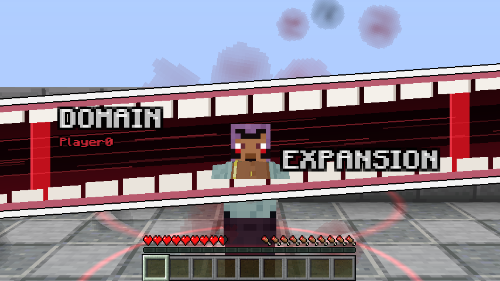
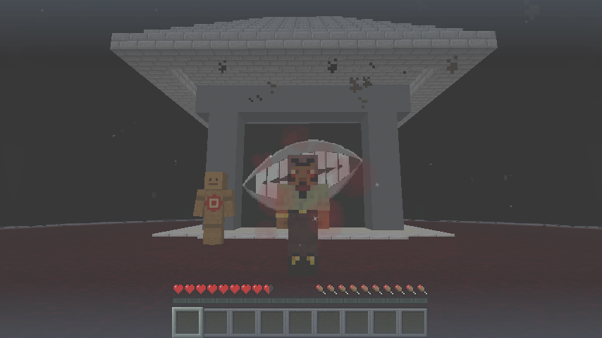
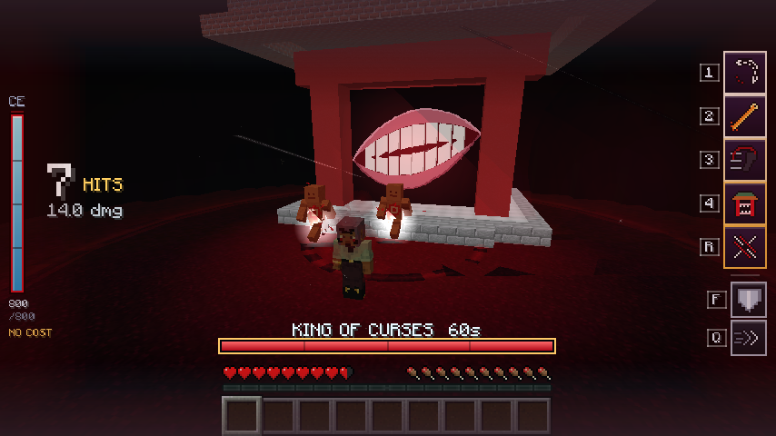

### Yuta Okkotsu — Cursed Partners

Tuned after the [Jujutsu Shenanigans wiki](https://jujutsu-shenanigans.fandom.com/wiki/Cursed_Partners) and its GIFs:
the wiki's damage, cooldowns and durations, studs as blocks, every move keyed from its GIF (the `yuta` section of the
config). 90 max HP. Rika is the new model, animated with the same clip framework as the players.

- **Swordsmanship**: his M1s draw the katana from the sheath at his left hip. It stays out for 8 seconds after his last
  katana move or M1, then goes back in. The necklace with Rika's ring hangs on his chest.
- **Severing Path** (15s): an 18-stud slide sweeping the floor with the blade (4). Whoever it catches is locked in
  front of him for three quick swings (2.3 each), the last launching them. A guard pushes him off. *Finisher*: the last
  slash beheads them. **Veilstep** (walking backwards): a 27-stud back roll with melee i-frames that launches anyone in
  the way (9).
- **Resolute Slash** (15s): he vanishes mid-swing and reappears at a spot within 25 studs to cut at the target's neck
  (12, unblockable). **Resolute Black Flash**: press it again the moment he reappears (the cast bar reads BLACK FLASH!).
  He vanishes once more and lands a heavy blow amplified by a Black Flash (12), with i-frames.
- **Outburst** (hold, 16s): a hand on the holstered katana, energy pouring in. The draw (2) sets off a burst (4) in
  a 13-stud radius that throws everyone upward. It deals its damage through a guard but can't kill through one. Held,
  it grows through three stages (the bar at his right), each adding 2 damage and about 2 studs of radius. The last
  stage is fully unblockable unless he was hit first. *Counter*: hit in the first 0.25s, the swing parries. A melee
  attacker is stunned, and a projectile is sent back.
- **Second Wind** (16s): a 20-stud rush with melee i-frames. He grabs the face (2) and slams them into the floor (8).
  A whiff leaves a second try. *Variant*: Severing Path right as he collides turns it into a pummelling. That is five
  blows; with the katana out, a few swings and a spinning axe kick.
- **Rika** (Special): the first press manifests her partly at his side. After that, R switches to her moveset (the
  ring glows under the crosshair) and his movement keys fly her about, up to 100 studs from him. Press R again, or use
  one of her moves, and his moveset comes back while she returns to his side. Hold R instead and she stays where she
  is. A double press dismisses her. Whoever the crosshair is on when R is pressed becomes her target. Her three moves
  share one 10s cooldown:
  - **Rika Smash**: her fist swells over the target and slams down (10). A target in the air is dunked into the
    ground (8).
  - **Rika Launch**: a boost forward, or upward in the air. Used mid-move it **feints** that move (6s).
  - **Rika Haymaker**: a slow, heavy blow that knocks them far back (12; 18 through a guard).
- **True Love** (G on a full meter; 60s, heals 25): "Come, Rika. Give me everything." He tears off the necklace and
  puts the ring on. Rika manifests fully and wraps a steel casing around his right arm. She stands off his right
  shoulder, out of his own camera's line, and eases after him when he turns or jumps; when she has to plant behind him
  (True Love Beam) she drops out of *his own* view so she never fills his screen (everyone else still sees her).
  **Steel Arm**: his
  fists, each of the first three M1s followed by a quick jab of the casing.
  - **Elbow Rush** (15s): a 38.5-stud dash into an elbow (4). Then he appears behind them with Rika in front, and both
    barrage them (5; 8 with Rika). A last blow launches them (6).
  - **Copy** (15s; 25s for an Awakening move): the technique picked on the Copy Wheel. His own is **Cursed Speech**:
    "動くな!" ("Don't move!") stuns everyone within 35 studs for 2.5 seconds. The rest are taken from whoever Rika
    attacks or kills, and play that sorcerer's move with Yuta as its user: Limitless from Gojo (Reversal Red MAX),
    Doors from Hakari (Shutter Doors), Shrine from Yuji (Dismantle), and Dismantle from Sukuna (Strong Dismantle).
  - **Copy Wheel** (G while awakened): two pages of four around the crosshair, each with its own cooldown. 1-4 pick
    one, R turns the page, and G closes it. Copies are lost on death.
  - **Energy Ripple** (18s): the katana driven into the floor sends out a dome of energy that pushes every enemy within
    27 studs away (19, unblockable). **Fakeout** (press again before the blade lands): a sudden swing instead (7) whose
    energy bursts inside them (12).
  - **Awakened Rika** (R): her moves each have their own cooldown.
    - **Rika Downslam** (13s): her arm slams down on them (8 + 4).
    - **Rika Slam** (13s): she grabs a leg and slams them five times.
    - **True Love Beam** (40s): a pink orb conjured together while he aims. Rika then plants herself behind him, jaw
      opening wide over his head, and the charge gathers, compresses and turns white while its path is traced on the
      ground. Then it erupts: a **5x5 square** torrent of cursed energy with square edges, for exactly 5 seconds from
      firing. Its layers move independently: a white core 2.5 blocks across, the pink main body filling the square,
      and an unstable aura of arcs, streaks, spiralling light, lightning and dark bands. It surges every 0.4 s, and
      a mass of energy 7-9 blocks across sits where it strikes. Damage is periodic: 20 on first contact, then 8 every
      half second a target stays in it, less the more players it catches. Its drawn shape is its hitbox. It carves an
      irregular 5x5 tunnel through the temporary battle damage system, so the terrain comes back later. Press it again
      in the wind-up for the quick beam from his hands (22.4, 15s). It stops for everyone if he dies or Rika is gone.
      It can be answered with Every Last Drop (see Beam clashes).
    - **Rika Throw** (13s): she picks him up and hurls him. An enemy he crashes into takes 8-18 by airtime. If he hits
      no one, he takes it himself and is truly ragdolled.
  - **Authentic Mutual Love** (4 while awakened; 120s, 45s): a pale stone platform under a black sky, grave crosses,
    rope knots circling overhead and Rika looming; the crosses rise out of the stone as it seals. Blades rain down and
    four land within reach, each carrying a technique you can read from across the arena: a column of its colour, a
    ring on the stone and its name (Shrine crimson, Thin Ice Breaker ice blue, Clairvoyance gold, Cursed Speech violet,
    Shikigami white). Standing by one, he takes it up, runs about 55 studs at the nearest enemy and swings (8), and the
    technique goes off:
    - **Shrine**: four Cleaves; missed, a horizontal Dismantle.
    - **Thin Ice Breaker**: the sky breaks like ice and their ragdoll can't be cancelled.
    - **Clairvoyance**: a manga panel marks them, and their attacks on him are dodged for 10 seconds.
    - **Cursed Speech**: "落ちれ!" ("Plummet!"); missed, "止まれ!" ("Stop!") freezes everyone.
    - **Shikigami**: three flying Rika heads swarm them.

    It breaks if no enemy is inside, and gives no Awakening progress. **Jacob's Ladder** unlocks after four direct
    blade hits: a gold burst round him, a gold glow while it's ready, and a banner above the hotbar naming the key.
    Press 4 again with a target in front of you inside the domain. A gold circle marks them, a ray comes down from
    the sky, and they are lifted and held. Then one blow takes 62.5 HP and 35% of their Awakening meter (50% if
    awakened), once, and the domain shatters with it.
- **Finishers** (under 20% health): Severing Path beheads, Resolute Slash cuts through the head, and Outburst bisects.
  Rika Smash leaves a puddle. True Love Beam atomizes into black mist. Jacob's Ladder lifts the soul while the body
  falls.

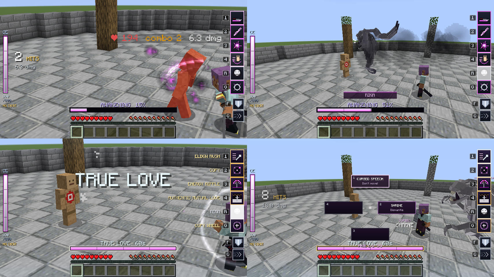
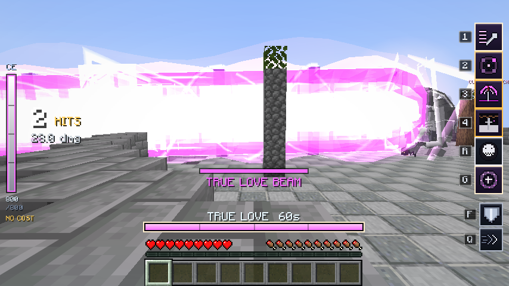
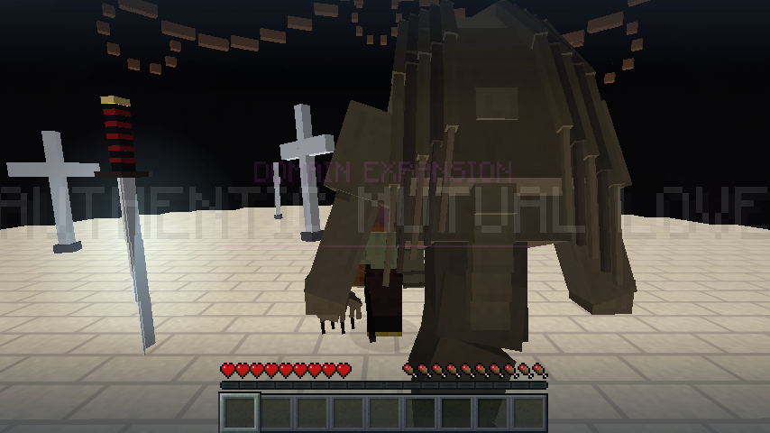

### Ryu Ishigori — True Cannon

100 HP. His Cursed Energy Discharge comes from the "cannon" of his pompadour, and Every Last Drop from his fingertip.
Discharges heat him up. Numbers follow the JJS wiki's *True Cannon* page, converted at about 3.6 studs per block.

- **M1s**: a 3-hit chain (3, 3, 4). While Overheat is under 90%, the neutral third hit is a ray from his head
  instead: 6.7 blocks, 8 damage, +10% Overheat.
- **Overheat** (the bar above the hotbar). The M1 ray adds 10%, Granite Blast 20% (40% held), each Appetizer blast
  10%, and Every Last Drop sets it to 100%. At 100% his discharges shut off and his head smokes until he cools down.
  The mark at 80% shows where Every Last Drop starts to awaken him.
- **Granite Blast** (1, 0.5s): tap for a blast that stuns the first target (5.5; ragdolls if they're already
  stunned). Hold 1.1 s for a piercing, unblockable blast that ragdolls everyone on the line (12, falling to 5.5 with
  distance). Right after a front dash, it loops a blast round him and dashes him on (4, 6s).
- **Unsatisfied** (2, 20s): three blows of 3, a back clash of 3 and a toss of 6. Each landed hit takes 0.5 s off
  Restyle's cooldown.
- **Second Helping** (3, 15s): rushes in up to 19.5 blocks and slams them into the floor (12), bouncing them
  skywards. In the air: a punch of 6, then a delayed impact of 6. Takes 3 s off Restyle.
- **Appetizer** (4, 18s): two blasts of 4, then a ray of 8 rising from the ground ahead, pulling targets up and in.
  Overheated, the blasts are cut and the ray pushes away instead.
- **Restyle** (R, 17s): cools him by 60% over a second. From 100% it is the comb instead: 2.75 s, all the way to 0%.
  Under Decadence he cracks his knuckles instead (+10 HP and +10% meter over 2 s).
- **Every Last Drop** (G, full meter): his whole reserve fired from his fingertip as the same 5x5 square torrent as
  True Love Beam (the same shape, size, layers and torn tunnel), in his blue. It charges for
  2.5 s and its aim locks 0.7 s before it fires. It deals 104, falling off with distance and the more players it
  catches, is unblockable and uninterruptible, and carves a round tunnel through the temporary battle damage system.
  It sets Overheat to 100%. Fired from 80% or more, it gives him **Decadence** for 90 s and heals 25.
- **Decadence**: no natural regeneration and Overheat locked at 100%. Below 30% health his meter absorbs damage
  (200 worth), and a fatal hit is survived at the cost of the awakening. Feinting or cancelling one of his first three
  moves costs 5 HP and puts that move on a 6 s cooldown.
    - **"What are you after?"** (1, 18s): floor slam 10, punch 20, launch 5. Costs him 5.
    - **"I had no idea..."** (2, 15s): armoured wind-up, grab 3, an exchange of seven punches each way, push 3.
    - **"This is what dessert is like!"** (3, 20s): kick 7, swing 3, four blows of 5, push 6, with full armour. The
      awakening's drain stops during the exchange.
    - **"You weren't invited."** (4, 20s): a punch of 20 (40 held 1.9 s) that sends them left. Aimed at a wall, the
      wall flies on as debris: 27.8 blocks (69.4 held), 20 to everyone it hits.

His sounds are the game's own, from the JJS Skill Builder's Ryu list. Every beat of every move has its own
clip, and Decadence brings its music with one of its two vocal takes. One clip (the first hit of "I had no idea...") is
on neither Roblox nor the mirror, so that move's second-hit clip stands in.

Choices where the wiki leaves room: natural regeneration is stopped by holding his hunger below the regeneration
threshold. Self damage from his awakened moves can't kill him, but feints follow the wiki. The awakening only comes
from Every Last Drop, so the Awakening key never transforms him on its own.

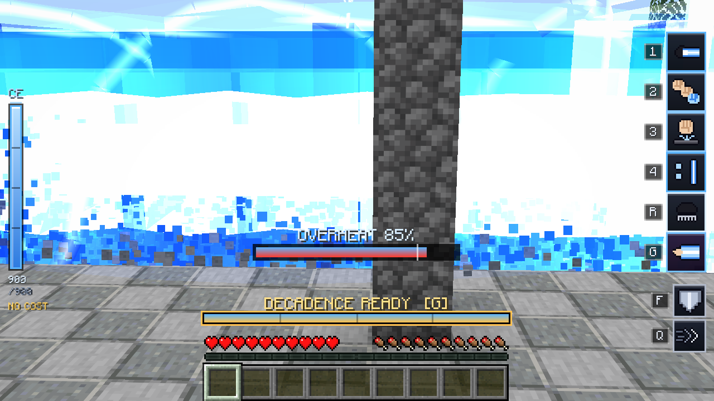
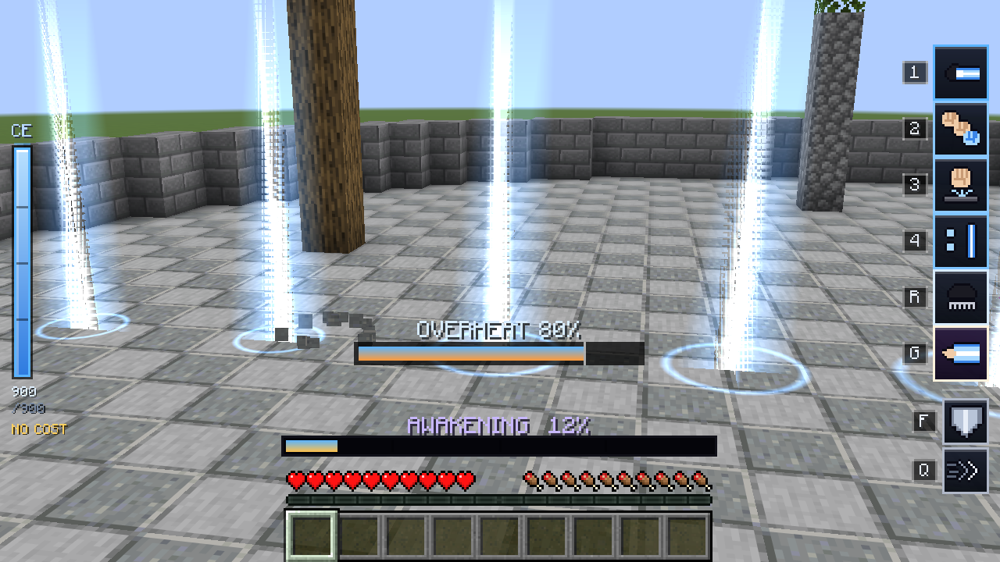
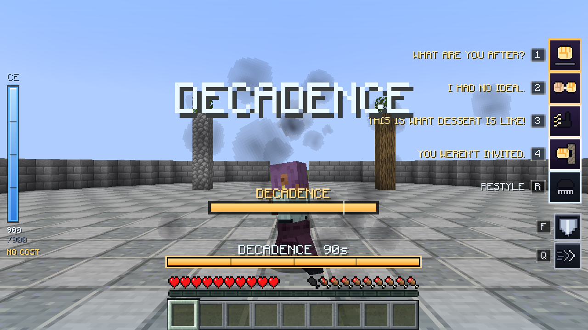

## Survival progression

In **Survival** you start as an ordinary person: no technique, no kit, and the K screen doesn't hand one out (it just
says *"You have not awakened a cursed technique."*). Kits are earned in the world through each character's
**storyline** (below), and **each kit belongs to one player per world**. **Creative** is the sandbox: K picks any
character, even one somebody owns, but a Creative pick is never ownership, completes no storyline and **stays in
Creative**: leaving Creative puts it away, back to the kit you legitimately own (or none). Survival alone still can't
swap: there K only switches between kits you own. In Creative (or with progression off) the first card
on K is **No kit**: an ordinary person with no technique (in Creative it also puts any test kit away). `progression.enabled: false` in the config turns all of
this off (free selection everywhere).

The path so far:

1. **Cursed Soul Sand** forms in Soul Sand Valleys, directly under the bone blocks of fossils (a few per chunk, never
   whole areas). It looks like soul sand gone cold, split by faintly pulsing violet cracks. Mined, it drops plain soul
   sand.
2. **Soul in a Bottle**: use an empty glass bottle on it. The soul streams out into the bottle and the block becomes
   plain soul sand.
3. **Cursed Energy in a Bottle**: brew Soul in a Bottle with a **Ghast Tear** in a brewing stand.
4. **Glasses**: `Glass · Iron Ingot · Glass` in a row. Worn on the face (head slot), drawn as a small frame on the
   head. They show nothing that isn't there.
5. **The cauldron**: pour four Cursed Energy bottles into a cauldron (1/4 … 4/4; the surface rises and glows). Throw
   the Glasses into the full cauldron: the energy reacts, spirals into them and collapses with a flash, all four
   units are spent, and **Cursed Glasses** rise out.
6. **Cursed Glasses** let their wearer perceive curses.
7. **Battle rooms**: Woodland Mansions and Igloos hide a cursed chamber far below them, reached by a trapdoor set
   into the building's lowest floor under a carpet and a ladder shaft. Over the seal at its heart hangs a **Cursed
   Breach** (the same as every incident's): use it and you are taken to the room's realm, a round hall of black stone,
   where the **Finger Bearer** takes shape (below). Its finger goes to whoever lands the last blow.
8. **Cursed Finger**: each room's Finger Bearer leaves exactly one when it dies, and a cleared room never fills again.
   It **no longer makes anyone Yuji** (Yuji is earned through his storyline). The world's Yuji, its vessel, can eat
   one: it is absorbed and counted, for the Sukuna progression to come. Anyone else is consumed by it and dies, whatever
   protects them.
9. **Character storylines**: villages, Essences, relics and personal trials (next section) are how a technique is
   earned.

## Character storylines

**Exploration is the character selection.** There is no menu: a player who wants Gojo goes looking for a Gojo village.

```
village storyline (4 events) → Essence → character object → full cauldron → the world's one relic → personal trial → base kit
```

**1. The village storyline.** Six villages in ten hold one character's storyline: Yuji, Gojo, Yuta, Ryu or Hakari.
Which one is decided once, from the village itself and the world seed (never from who visits, never re-rolled). Its
first report is pinned at the top of the news board and is recognisable without naming anyone:

| Storyline | The first report | Where it goes from there |
|---|---|---|
| **Gojo** (space, distance, perception) | *Unusual Distance Reported Along the Northern Road*: a watchtower that never gets closer, a figure beside it at night | a cliff you fall from and land back on top of; a cottage larger inside than out; a second watchtower whose lamp shows the whole valley |
| **Yuji** (cinema, human tragedy) | *Strange Activity Reported at Abandoned Theater*: the same film every night, and someone who went in | the family who stare at the wall; what is kept in the old mine; the final screening |
| **Yuta** (love, protection) | *Unexplained Attacks Surround Local Resident*: people hurt approaching them, a woman's voice | the resident walking to the cliffs, kept from the edge; flowers where nobody died; a promise at the old chapel |
| **Ryu** (output, destruction) | *Unexplained Destruction East of Village*: a flash, a single enormous impact | another flash, farther out; a tunnel blasted into the hill; the impact point |
| **Hakari** (gambling, luck) | *Late-Night Activity Beneath Abandoned Storehouse*: bells, coins, someone winning for three nights | the winner who never leaves; coins at the bottom of the mine; the last round |

Each storyline is four events (discovery, escalation, revelation, finale), each an ordinary investigation with its own
place, trigger and realm: the board says roughly where, the **Cursed Compass** finds the exact spot, the report tells
you what happened, and you work out what to do (walk up to the watchtower after dark, step through the cottage door,
ring the storehouse bell, touch the shard at the bottom of the crater...). Every fight is in the Cursed Dimension, in a
realm made of the event: the road that never arrives, the theater, the crater, the fight club under the storehouse, the
chapel garden (plus the existing cliff, mine and house realms). New places: the **watchtower**, the **abandoned
theater** (its projector is a jukebox), the **storehouse** (a bell over the trapdoor), the **crater** and the **old
chapel**. A storyline's event never goes stale; completing one brings the next report; ordinary news carries on beside
it.

**2. The Essence.** The finale condenses that storyline's own Essence (*Yuji, Gojo, Yuta, Ryu, Hakari Essence*) for
everyone who took part, handed over with a title card once they are back in the world (a logged-out participant gets
theirs when they return).

**3. The character object.** Each Essence is crafted into its character's object, which is **dormant**:

| Essence | Object | Recipe |
|---|---|---|
| Yuji | **Human Earthworm VHS** | Essence in the middle, redstone either side, black dye above and below, iron nuggets in the corners |
| Gojo | **Blindfold** (worn on the head) | three black wool over string · Essence · string |
| Yuta | **Cursed Ring** | a diamond over iron · Essence · iron, iron below |
| Ryu | **Comb** | three bones over bone · Essence · bone |
| Hakari | **Scratch-Off Ticket** | paper and gold nuggets round the Essence |

**4. Infusion.** Drop the object into a **full** Cursed Energy cauldron (like the glasses). Cursed energy erupts and it
rises out **infused**: the world's one functional relic of that character. **One per character per world**, across
every dimension, whoever is online: the world keeps a registry (`<world>/jjk_progression/unique_relics.dat`), and the
claim is made atomically when the energy collapses, so two cauldrons racing for the same character produce exactly one
relic (the other gives its object back). A relic carries the world's token: a copy is cold. It never despawns on the
ground. If it is **destroyed** before its storyline is complete (lava, a cactus, the void) the world may forge another
(from a new Essence); if its **keeper** (the last player to use it) loses it, they can infuse the object again and the
lost one goes cold. Recovery never makes two. In Creative the cauldron makes a *test relic* that claims nothing.

**5. The personal trial.** The relic still grants nothing. It is the key to that character's own story, and the player
has to work out how to use it:

- **Yuji: the VHS, played on a jukebox.** An ordinary film... until the man on the screen turns and looks at you. In
  the theater, weapons do nothing to what rises out of the seats: **the body is the weapon** (bare fists strike with
  cursed energy, hard; now and then a black spark). Three waves, the last at the final reel.
- **Gojo: the Blindfold, worn.** Everything goes dark, and then you begin to see: curses glow, a flare warns of what is
  about to strike. On a road that folds back on itself you fight by perception. Take it off too soon and it's over.
  Then **the blindfold comes off**: a white-out, an iris of blue light, "I can see everything", and a last wave with
  everything in view.
- **Yuta: the Ring.** A presence fills the chapel garden and closes in whenever you look away. It only ever strikes what
  comes for you: let it protect you (running from it frays the bond), then fight beside it while it holds what comes
  near it. At the end it waits beside you: **use the ring** to accept the bond. It cannot be killed; that is not the
  answer.
- **Ryu: the Comb.** *"Are you satisfied?"* Wave after harder wave in the crater; after each, two pillars rise: walk to
  the **gold** one for MORE, the **grey** one if you are satisfied (that ends it in failure). The fifth wave is *Every
  Last Drop*: every blow you land is an enormous blast.
- **Hakari: the Scratch-Off.** Scratch it: no win. Scratch again: no win, and the numbers moved. The third time, the
  fight club. Every round the reels draw a wager against you (your health, cursed energy, healing, your grip, your
  legs) for the round; win it and it comes back with interest. Round four: **7 · 7 · 7, JACKPOT**, and a fever.

Completing the trial **claims the base kit**: the world records you as its Yuji (or Gojo...), through the same atomic
one-owner registry as every path (`kit_ownership.dat`). Offline owners keep it; death, dimensions and restarts change
nothing. **The base kit only**: every move and R variant, never the Awakening, which belongs to that character's own
later storyline. Dying or leaving a trial (or a restart) fails it; the relic waits to be used again.

**Admin** (op): `/jjk story villages | set <kit|none> [stage] | essence <kit> [player] | trial <kit> [claim] | complete |
trials | awaken <kit> <player> on|off` · `/jjk relic list | reset <kit> | issue <kit> [player]`. Assets come from
`tools/gen_story_assets.py`.

### The Finger Bearer

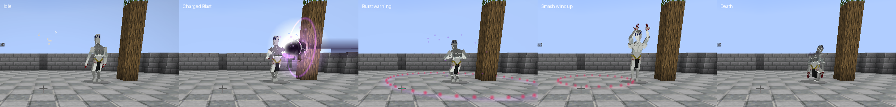

A gaunt, long-armed curse (the supplied `cursed_spirit` model) that fights the way the anime's finger bearer does: raw
cursed energy and sudden brute force, no technique and no domain. **Without Cursed Glasses you can't see it, and it
won't touch you**: it can't take you as a target, and its blows, shots, blasts and bursts pass through you (every hit
goes through the same rule). Wearing the glasses, you see it, and the moment it sees you it roars and the fight begins.
**Taking the glasses off after that doesn't save you**: it keeps hunting someone it has turned on (you just can't see
it). Leaving the room ends the chase; left alone, it slowly heals.

It runs one move at a time. Each has a readable windup, lands at most once, and leaves a recovery and a cooldown:

| Move | Tell | Avoid it | Punish |
|---|---|---|---|
| **Cursed Energy Shot** | draws its palm back to the shoulder (0.6 s), then thrusts | step sideways: the shot flies straight at where you were | short recovery |
| **Charged Blast** | sinks low, energy gathering between its claws for 2 s | sidestep the slow orb; it bursts where it lands | winded for ~1.8 s on a miss (0.8 s on a hit) |
| **Point-Blank Burst** | used when you crowd it or stand close while it charges: curls up, and a ring on the floor shows the radius for 0.9 s | get out of the ring | short pause after |
| **Brutal Rush** | crouches with its arms swept back (0.7 s), then charges in a straight line | step out of the line | a miss or a wall leaves it staggered ~1.8 s |
| **Heavy Follow-Up Smash** | both arms overhead (1.1 s); a ring marks the spot | step off the mark, or guard / raise a shield | bent over the floor ~1 s |
| **Leap** | keep your distance (or climb above it): it crouches, and a ring marks where you stand | get out of the ring before it comes down | the landing breaks soft ground and leaves it winded 1.5 s |
| **Backhand Spin** | stay at its back for a moment: it wheels round, a ring at its feet | don't loiter behind it | short |
| **Cursed Pools** | where a Charged Blast bursts the energy stays on the floor for 6 s (enraged: it throws three down on purpose) | stay out of them: they hurt and slow | — |

The smash follows a rush that connected, but never so fast that you can't move first. Walls stop its shots, its rush and
its area damage. It is a **Grade 1** curse and the wall at the start of progression: **ordinary weapons don't hurt it
at all** (you need a cursed tool, below), and at half health it **enrages**: a roar that throws everyone back, then
shorter rests, its shots in a fan of three, and pools thrown down on purpose. It has 300 health and 4 armour, and no single hit takes more than 12 health from an unarmoured
player (`progression.fingerBearerHealth`, `progression.fingerBearerDamage`). Mid-move it shrugs off hitstun; between moves
a hit makes it flinch.

**Curses and perception.** A curse that needs perception (entities implementing `CursedSpirit`, or in the
`jjk:requires_curse_perception` entity tag) is drawn only for players who can perceive curses, decided per player by
the server: the same entity, seen by one player and not another. It can't start a fight with someone who can't see
it. Once it has turned on someone, though, it remembers: taking the glasses off hides it again, but it keeps
attacking. Perception comes from sources registered in `CursePerception`: anything worn from the
`jjk:grants_curse_perception` item tag (Cursed Glasses, the Infused Blindfold), a personal trial in progress, and
**owning a kit**: once a player legitimately owns a character (the world's kit record), they see curses with their own
eyes in every dimension, glasses or not, for as long as they own it. Hostility lives in `CurseAggro`, kept apart from it.

**For kit acquisition paths.** Every path calls `TechniqueProgression.acquire(player, KitAcquisition)`. That claims the
kit atomically in `KitOwnership` (the world's `kit → owner` record, `<world>/jjk_progression/kit_ownership.dat`), records
it in the player's own progression data (checked against the world's record on every join), and runs the path's own
outcome for *claimed*, *already yours* and *someone else's*. Today the only path is a completed personal trial
(`RelicAcquisition`).

**Admin** (op): `/jjk kit list | owner <kit> | info [player] | grant <kit> <player> | transfer <kit> <player> |
release <kit> | repair | rooms`. `/jjk character` is still an admin override; under progression it lasts until the
player relogs or leaves Creative (a Creative K pick is the test kit above).

## Investigations, curses and Mastery

The long loop of Survival: **villages report strange happenings → you investigate → you find and exorcise the curse
behind it → the Mastery you earn develops your cursed tool.** A technique is no longer developed through Mastery: it
comes whole from its storyline, and grows through that character's own story.

### Curse grades and cursed damage

Every curse has a **grade** (Grade 4, 3, 2, 1, Special), saved per entity, so the same kind can turn up weaker or
stronger. The grade scales its health, its damage, how quickly it attacks again, how much cursed energy it shrugs off,
what exorcising it is worth and how bad the reports about it sound (`CurseGrade`). Damage to a curse is classified
(`CursedDamage`): **mundane** (any vanilla weapon or fist: a curse is simply unharmed, a grey puff), **cursed tool**,
**technique** (a cursed technique in use) and **cursed energy**. Commands and the void still kill anything.

### The common curses

Three curses from the supplied pack (`fly_head`, `school_crawler`, `school_maw`: Blockbench models, textures and
idle/move/attack/hurt/death clips, installed by `tools/install_bbmodel.py`). Seen only through Cursed Glasses, like the
Finger Bearer, and each fights differently:

| Curse | Grade | How it fights | How to beat it |
|---|---|---|---|
| **Fly Head** | 4 | comes in swarms that circle you just out of reach on wobbling orbits, one diving at a time to bite | sidestep the dive (it overshoots); a swatted one scatters for a moment |
| **School Crawler** | 4 (strong) | scuttles round you at mid range, presses flat (the tell) and pounces; up close, a raking swipe, then backs off | sidestep the pounce: it skids past and lies sprawled for 1.5 s |
| **School Maw** | 3 | slow, all mouth: its tongue lashes out along a line and reels you in front of its jaw, and the bite follows at once; otherwise a long gaping bite | get out of the tongue's line; a missed bite leaves it hunched over 1.4 s |

### Cursed tools

An ordinary person's first way to fight curses. Drop an **iron sword** or an **iron axe** into a full Cursed Energy
cauldron (like the glasses) and it comes out as a cursed tool. A cursed tool still works in the hand, but its real use is
the **Cursed Item slot**: a dedicated slot in the inventory (next to the player, outlined in violet; in the Creative
inventory beside the armour) that takes only cursed tools. **Whatever is in it gives you its complete moveset**, built
on the same ability system as the techniques: moves on 1-4, an R variant, an ultimate on G, its own M1 chain and
passives, its own cooldowns.

- **No technique?** The tool's moves are simply yours.
- **Have a technique?** Press **X** ("Switch moveset", rebindable) to swap between your technique and the tool. It only
  works from a free moment (not mid-move, mid-swing or stunned), is locked for a moment after, and **never resets or
  refunds a cooldown**: each moveset keeps its own, and they keep running while the other is in use.
- **Mastery stays apart**: tool moves (and tool M1s) pay into the tool's own tree, technique moves into the
  technique's. Learned moves need their node in the tool's tree first; the tree changes the moves themselves, not just
  numbers. Death drops the equipped tool with the rest of the inventory (keepInventory keeps it).
- **Rarity**: the starter tools are common (anyone can make as many as they like). Only a cursed **weapon of
  technique-level power is one per world**: so far, the Cursed Rifle.

| Key | Slaughter Demon (from the sword: short, fast) | Cursed Cleaver (from the axe: slow, crushing) | Cursed Rifle (unique: the hunting lodge) |
|---|---|---|---|
| 1 | **Quickstep**: dart forward, cutting the first in your path. R during it: **Return Cut** back the way you came | **Heavy Swing** (hold): wind up, release; a full charge breaks guards. R during it: **Whirl** | **Snap Shot**: snapped to the shoulder, fired on the 3rd tick |
| 2 | **Flurry** (learned): four quick cuts. R: **Rising Flurry** launches | **Shoulder Charge**: drive through, slam into walls | **Aimed Shot** (hold): raise the scope, let it settle, let go |
| 3 | **Severing Point** (learned): a weakened Grade 3-or-lower curse is cut apart | **Ground Splitter** (learned): a crack runs along the ground | **Suppressing Volley** (learned): braced and scoped, three rounds 4 ticks apart |
| 4 | **Mirror Parry** (learned): a stance; a blow caught in it is turned and answered from behind | **Iron Wall** (learned, hold): absorb blows, then swing back harder for each | **Lens Flare** (learned): canted on its side, a lens flashes where you aim (3rd tick): blinded and staggered |
| R | **Draw Cut**: a wide sweep from the sheath | **Haft Strike**: a fast interrupt | **Stock Bash**: a butt-stroke for room (lands on the 2nd tick) |
| G | **Thousand Cuts** (awakening node): flicker between up to five foes | **Executioner's Arc** (awakening node): leap and crash | **Unfolding Array** (hold): the beam |

**How they look.** Each tool has a grip profile (one hand, dagger, spear, two hands, heavy, ranged). Holstered (your
technique in use) it rides on your body where everyone can see it: the Slaughter Demon hangs at your left hip, edge down,
the point trailing back; the Cleaver and the Rifle are slung diagonally across your back, head and muzzle up at the right
shoulder. Switch to the tool and you draw it (a short reach to the hip or over the shoulder, and the sound of it) into
your hand, even with the hand slot empty, in first person and third; two-handed tools bring the off arm in. Every move
has its own animation, shaped by the grip (`animations/tool/`, generated by `tools/gen_tool_kit_anims.py`): the blade's
low darts and decisive cuts, the Cleaver's wide stances and blows the whole body drops into; the Rifle's body is built
live by its stance (below). Whether a tool is drawn is synced, so other players see the same.

The trees (`data/jjk/mastery/tool/*.json`): Slaughter Demon's Footwork, Edge, Stance and Kill lanes (Long Step, Keen
Edge, Light Grip, Return Cut, Flurry, Parry, Precision, Rising Flurry, Long Parry, Extra Cut, Severing Point, Deep Sever,
Thousand Cuts); the Cleaver's Heft, Momentum, Heavy Swing, Splitter, Guard Break, Iron Wall, Whirl, Long Split, Enduring
Wall, Shockwave and Executioner; the rifle's tree below.

- **Cursed Rifle** (from the hunting lodge, below; **one per world**): a scoped rifle with four folded support arms round
  its barrel. It is a ranged tool for anyone, technique or not, and it **fights only from the Cursed Item slot**: put it
  there and switch to its moveset (with no technique it is simply yours). Held in the hand it is just an item, and use
  only tells you where it goes. Holstering it, taking it out of the slot, dying, leaving or changing dimension end
  whatever it was doing, and the array's cooldown survives all of them. Its own **reserve** (100, refilling 5 a second,
  kept per player) pays for everything, and the server decides every shot and every hit.
  - **How it is held** (`client/rifle/RifleStance.java`): the whole body fights with it. A bladed stance (support foot
    forward, knees soft), the stock in the shoulder pocket at a relaxed low ready; aim runs head, shoulders, torso, arms.
    Both hands are solved onto the rifle every frame (trigger hand on the pistol grip, support hand under the fore-end,
    the shoulders reaching forward when they must), so they never float: through walking, strafing, backing up, the
    high-port carry while sprinting, jumping, falling, landing, crouching, hit reactions and every move. Aiming brings
    the scope's eyepiece to the eye. Each shot kicks the rifle back into the shoulder. Unfolding Array plants the feet
    wide and sinks into a brace as the arms deploy, shudders through the charge, holds a live brace, is driven back by
    the beam, then straightens. The rifle model's own clips (arms, iris) play on it in step. First person shows the same
    action (`RifleFirstPerson`): both arms on the rifle, the eyepiece up to the eye before the scope view, the brace, the
    kick, the bash. Everything follows the server's phase and move timing, so every client sees the same; shots and the
    beam leave the drawn muzzle. Every move has its own HUD icon.
  - **Normal shots**: Aimed Shot (2, hold) raises the scope (the view zooms, the reticle settles); let go to fire. Snap
    Shot (1) is a hip shot that sways far more. Each shot costs 12, deals 7 and needs 18 ticks for the bolt to cycle. The reticle
    drifts exactly as the server's aim does: where it sits is where the round goes. The rifle plays its `normal_shot`
    clip, with a muzzle flash, a tracer to the impact and a kick of the view.
  - **The beam** (once Unfolding Array is learned): hold G. The arms unfold (`deploy`), the lenses build
    (`charge`), and it holds ready (`charged_hold`, draining 4 a second). Let go to fire (`beam_fire`: the arms stay
    deployed for the whole beam), then it vents (`cooldown`) and folds away (`retract`); 12 seconds before the next.
    Letting go early, holstering, running the reserve dry, dying or leaving cancel it at any point and the arms
    retract. Every client nearby plays the same clips at the server's timing. The beam is the shared square torrent
    (the same profile as True Love Beam and Every Last Drop: the drawn beam is the hitbox), starting at the model's
    `beam_origin`; it carves terrain that is restored like all battle damage.
  - **Its tree** (`data/jjk/mastery/tool/cursed_rifle.json`): Marksman (Steady Hands, Settle, Heavy Rounds: less sway,
    faster settling, +15% damage), Mechanism (Quick Bolt, Frugal Rounds, Oiled Action: faster cycling, cheaper shots),
    then **Unfolding Array** (80, the beam), the Array lane (Lens Economy, Fast Focus, Sustained Fire: a cheaper, faster,
    longer beam), the Output lane (Harmonised Arms, Focused Lenses: a stronger, wider beam) and the capstone
    **Maximum Output** (220). Every upgrade is capped (`JJKConfig.rifle`: sway no lower than 35%, shots no cheaper than
    55% and no faster than 9 ticks, damage at most +50%, beam at most 70 ticks).
  - **Maximum Output**: the beam at full output, as wide as True Love Beam and Every Last Drop (5 blocks) and as strong
    in a clash: a white-hot core in a deep orange torrent, orange streaks, a hard flare where it strikes. The first unlock
    is a narrower (2.2 blocks), dimmer orange beam at 0.45 output; the lens upgrades raise it to at most 0.8.
  - **Beam clashes**: the rifle is one more ultimate beam in the shared system (below), with no special rules. A rifle
    holding its charge can answer True Love Beam, Every Last Drop or another rifle in the counter window (it opens when
    the opponent starts charging; let go of G to answer), and is answered the same way from the moment its arms start
    to deploy. Charging alone never starts a clash. Its clash strength is freshness x output: the first unlock is
    overpowered by a fresh full-power beam; Maximum Output meets one on even terms (the full, doubled duel).

### Mastery

The **Mastery screen (J)** shows the tree of the **cursed tool** in your hand. Lanes are columns, tiers go down; lines
join prerequisites; each node shows whether it is owned, available or locked, its cost, which move it belongs to and
what it does. Click a node to read it, double-click (or Develop) to buy it. The server checks every purchase. Costs live
in each tree's JSON; `mastery.costMultiplier` scales them all.

**The technique trees are retired.** Character progression no longer runs through Mastery currency, +damage nodes or a
purchasable Awakening. A character's **base kit comes whole** from its storyline (every move and every R variant:
Limitless variants, Face Grater, Black Flash, Veilstep, the charged Granite Blast...), and **the Awakening stays closed**
until that character's own later storyline opens it (`/jjk story awaken` for testing). The tree files
(`data/jjk/mastery/technique/<kit>.json`) stay for reference, and a node bought under the old system still counts, so
no existing save loses anything. Creative, progression switched off, and anything that isn't a player (dummies,
curses) always have the whole kit, Awakening included.

**What exorcising pays.** Each curse is worth its grade's Mastery (Grade 4: 6, Grade 3: 14, Grade 1: 70...), split by
damage share: first between the players who fought it, then each player's part between what they hit it with. Only a
cursed tool's share is paid (a technique's share isn't: its tree is retired), and using both never pays double. Killing the same grade over and over pays less each time (fatigue, which wears off with
time); investigations always pay at least 60%, and **completing an investigation adds a bonus** for everyone who took
part (Grade 3: +26). Exorcisms and investigations are recorded per grade for the future **Sorcerer Grade** (Unranked →
Grade 4 … Special Grade), which is kept apart from Mastery.

### Village news boards and investigations

Walk into a village and its **news house** goes up by the bell, built in the village's own style (plains, desert,
savanna, taiga or snowy): a small gabled building, door toward the bell, with the **news board** on its back wall, a
lectern where someone keeps the record (a librarian's work site, so villagers come and use the place), a desk strewn
with papers, a bookshelf and a barrel of old notices. The board shows as many pinned notices as the village has news
(none to four). Where there's no flat open ground for the house, the board stands in the open by the bell. Read it
(use it). It is local news, not a quest log: missing people, livestock found worried at in the night, strange sounds,
a fall from the cliffs. Nothing says *curse*, nothing has a marker or a waypoint; a report says roughly where
(*"the cliffs northeast of the village (a short walk out)"*) and its tone says how bad it is.

Each incident is a template (`data/jjk/incidents/*.json`: its curses and grade, the kind of place, its trigger, its
realm, its report texts) placed at a real spot that fits it near the village (a ten-block drop for a cliff, flat
grassland, a hillside for a mine). At the place there are physical traces (flowers and a candle at the edge, bones in
the grass, a boarded mine entrance), and through Cursed Glasses a faint **trail of cursed residue** leads the last
stretch. No checklist, no HUD.

**Every incident is entered the same way: through its Cursed Breach.** Report → travel to the area → the Cursed
Compass → the place itself → a **Cursed Breach** hanging there → **use it (right-click)** → a short pull → its cursed
realm. A breach is an upright tear in the air: black at its heart, a ragged crimson edge that crawls, cracks running
out into the air round it, a thin ring turning slowly, motes and dust drawn in and swallowed, a low drone, and a slow
pulse (faster once someone is already through: use it to join them in the same fight). Nothing else sets an incident
off: no jump, no bed, no doorway at midnight. Where the breach hangs is the place's story; how you go in never changes.

| Incident | Grade | Where its breach hangs | Where the fight is |
|---|---|---|---|
| **A fall from the cliffs** | 3 | at the lip of the cliff, where it happened | the cliff, broken off and hanging in a red void |
| **Livestock lost in the night** | 4 | in the pasture, among the bones | an endless dead field at night |
| **The old mine** | 3 | at the far end of the tunnel, deep in the hill | a low cavern of wet rock |
| **Nobody will stay in the old house** | 3 | inside the abandoned cottage, between the door and the bed | the house's rooms, laid end to end and too long |
| **Gunshots at the old hunting lodge** (uncommon) | 3 | out in the trees, where the scope shows the figure | the woods through the scope, distorted |
| Character storylines | – | at each site's centrepiece (the theater's projector, the watchtower's lamp, the storehouse bell, the crater's shard, the chapel altar), or as above for the shared kinds of place | that event's realm |

**The hunting lodge.** Reported as gunshots after sunset round an old hunting lodge, with a landmark that is really
there (*"beyond the northern ridge, near the spruce forest"*: a ridge only if the ground rises between them, the woods
by the site's biome). The lodge is weathered, its windows broken, hunting gear left where it lay, a sealed gun rack on
the back wall and a rifle scope mounted on the front windowsill. Round it: two abandoned hunting stands, trunks scored
and blackened where they were shot at, a line of tracks that just stops, and now and then (far more often at night) a
distant gunshot with nobody there. Each one you find is noted once (per player, saved with the incident).
Put your eye to the scope (use it): through Cursed Glasses something out in the trees doesn't belong. Hold the scope
on it and it resolves into a crooked trail and a figure standing on it, with a heartbeat, where the air is torn: the
lodge's breach is out there, at the end of the trail. Without perception the spot only "doesn't sit right" (the
breach is there either way; the scope only shows you where to walk). Inside is the distorted forest:
trunks that kink and lean the wrong way, the same hunting stand again and again, a path that doubles back. It holds the
**Hunter's Shade** (Grade 3, 48 health): it keeps to the trees, slips out of your line of sight when you look straight
at it, and closes in cover to cover when you don't. Before it attacks it shows itself: it stops dead in the open, its
eyes light, a dry rattle carries, and about a second later it lunges straight along the line it locked. Sidestep and it
crashes down **exposed** for two seconds (taking 60% more damage); crowd it and it rakes after a short wind-up and
breaks away. Nothing it does comes from out of sight. A starter cursed tool beats it. *(Its model is a placeholder:
the School Crawler's, darkened and scaled up.)*

When it falls, everyone who went in is **owed a Cursed Rifle**, saved with the incident apart from its completion: the
rack's seal breaks and the rifle rests on it. The first of them to take it from the rack, deliberately, **bears the
world's one Cursed Rifle**: a full inventory leaves it waiting, and a late return, death, logging out or a restart
change nothing. Nobody else can take it, and while it has a bearer no other lodge's rack has one to give (its pegs are
bare). Every rifle carries a claim: its bearer, if they lose it, can **recover** it at the rack, and the lost one
(wherever it is) goes cold rather than making two.

Exorcise every curse and the incident is over: the bonus is paid, and the board posts a follow-up. **The site then
comes down**: whatever its building changed (recorded block by block when it went up, saved with the incident) is
put back as it was over a few seconds, top-down, wherever its ground is loaded (a restart, a relog or an unloaded chunk
only pauses it), so the place is free for the next one. Only the site's own blocks are touched: anything a player has
built or changed there since, and everything around it, stays. A lodge waits until nobody is still owed its rifle. A
new incident is never put within 64 blocks of a site that is still standing, so two players' investigations never
build over each other; in the Cursed Dimension each investigation has its own arena slot, and one closing clears only
its own. Left alone for three
days a report goes stale and something else gets reported.

**The Cursed Compass.** The board only says roughly where (*"Reported Location: about 150 blocks northeast of
Ashford"*); finding the exact place is the compass's job. Dip a **compass** into a full Cursed Energy cauldron for a
**Cursed Compass** (dark, violet-rimmed, a pale needle). At the board, open a report and press **Investigate** to make
it your current investigation (press it again, *Set it aside*, to drop it; the report shows an *Investigating* stamp
and its notice a red tag). The compass then behaves like a vanilla compass bent the wrong way: with no investigation
it hangs still; far from the reported area it only wanders; once you are within 160 blocks it settles on the exact
place the incident is anchored (the cliff's lip, the mine's end, the lodge's anomaly, the house), trembling more the
closer you get, with dark motes off it and a heartbeat that quickens, and **thrashes** when you are on top of it.
Using it says in a few words what it feels. It never tells you what sets the incident off. Once the incident is over
its needle goes slack.

**Every cursed-event fight happens in a cursed realm**, never in the overworld. Realms are arenas in one void
dimension (`jjk:cursed_realm`), one slot per incident in use, built from a per-incident layout (the cliff, the mine,
the forest, the pasture, the house, a plain hollow one for anything else, the Finger Bearer's hall) when the first
player is taken, and **cleared back to empty void when it closes**: no new dimension per incident and nothing left
behind. Anyone who sets the incident off while it is open joins the same arena (never a duplicate).

- **The transition** (about two seconds): you are held where it caught you, sound dulls to a heartbeat, the edges of
  the screen close in black and pulse twice, the view goes dark, and you arrive; the dark lifts over a second and a
  half. Nothing hurts you meanwhile.
- **What sets them off**: only ever using the incident's Cursed Breach (above).
- **The way back** is solid ground near where you were taken: where you stood, or (caught mid-jump) the ground back
  from the edge. When the last curse falls, everyone inside is sent there a few seconds later.
- **Death** respawns you as usual and the arena carries on for the rest. A realm nobody is in for a minute (everyone
  died, fled or logged out), or a server restart, closes it and the incident can be tried again. Logging out
  mid-transition sets you down safely; logging in inside a realm that has closed sends you home.
- **Nothing leaks**: an incident's curse found anywhere but its open arena (after a crash, a reload, an arena closed
  while its chunk was unloaded) removes itself. Falling off the edge of an arena puts you back on its ground.

(A world without the dimension builds the arenas far out in the overworld's sky instead.)

**Admin** (op): `/jjk mastery info|give|buy|respec <player> ...` · `/jjk incident list|realms|here <template>|start <id>|complete <id>|show <id>`
(`here` puts an incident where you stand, facing its direction: stand on a cliff edge looking out for a cliff fall; a
lodge's window faces the way you face) · `/jjk rifle state|energy <n>|phase <phase>|issue` (the rifle's numbers, its
reserve, a forced phase such as `ready` to test a clash answer, a claimed rifle as a lodge would give).

## The Prison Realm

**Only one Prison Realm can exist in a world.** Craft a **Dormant Prison Realm** (four shulker shells round a nether
star: one above, one below, one each side) and use it on a **full** cauldron of cursed energy (4/4). The energy is
spent into it and the **Prison Realm** rises out, but only while the world has none: while one exists the cauldron
refuses the cube. The realm is fire-proof and never despawns on the ground; if it is ever destroyed (a cactus, an
explosion, the void) another may be forged. Every cube carries the world's id for it, so a copy or an old cube is inert.
`/jjk prison reset` (op) forgets a realm that was lost for good (say, in a deleted player's inventory).

**Sealing.** Use it on a player in front of you (within 8 blocks), or on any creature, just for fun. **Sneak-use it with
nobody in front of you to seal yourself**. The cube lands at their feet and plays its whole sequence: it opens, the
restraints reach out at 2.6 s, they are drawn in, and the seal closes at 5.15 s. Until the restraints reach out they can
get away by getting more than 6 blocks from it. Dying, logging out or leaving the dimension before it closes also fails
the seal. A failed seal drops the cube where it lay, and only one seal can run at a time.

**Sealed.** The cube lies closed where it caught them: invulnerable, anchored, glowing through walls, with a crimson beam
rising from it so it can be found from far away. It is saved with the world, and if its body is ever removed (a
command) it comes back. Hitting it, moving it, killing it or picking at it never releases anyone. The captive is in a
cell built high above it in the same column, out of unbreakable flesh (anything it replaced is given back exactly
afterwards). There is no way out but the two below:
- Leaving the cell any way at all (an ender pearl, a command, a portal, another dimension, dying and respawning,
  logging out and back in) puts them straight back.
- Their techniques are sealed in there.
- Their inventory follows the normal rules: a death drops it in the cell, where it never despawns, and it comes out with
  them on release.
- Other players can't get in.

**Escaping alone: only if you sealed yourself.** Anyone sealed by someone else is trapped: their cell has no locks, and
only someone outside can open the realm (or an admin). Escaping alone is deterministic, repeatable, and saved through
death, logout and restarts:
1. Four seal locks, one in the middle of each wall, glow open in turn on a fixed rhythm: every 2 seconds, each a
   quarter-beat after the last.
2. **Use a lock while it glows** to break it. Using a dark one lashes back (a little damage, a shove) and re-forms that
   stage's broken locks.
3. Break all four to clear a stage. There are three stages, and the glow is shorter each time (0.7 s, 0.45 s, 0.3 s).
4. Then the **core** in the floor opens: use it.

The action bar always shows the stage and the seals broken.

**Rescue from outside.** Anyone else can open the grounded cube: **sneak and hold use on it for 5 seconds**, staying
within 3.5 blocks. Letting go, walking off or taking damage interrupts it, and the cube closes again. The rescuer and
the captive both see the progress, and the cube shudders more as it gives.

**Outside view.** While sealed, **V** (rebindable: "Prison Realm: look outside") swings the camera out to the grounded
realm, turned with the mouse like F5. It is watching only: movement, jumping, attacking and using do nothing while it is
on. V again, the release, death or a disconnect puts your own camera back.

**Release.** The cube opens, the captive steps out beside it, and the cube is an item again (the same realm, ready to
use again). The Prison Realm **no longer makes anyone Gojo** (he is earned through his storyline): a genuine seal and
release, by their own escape or a rescue, is counted on the player for later progression, nothing more; an admin
release (`/jjk prison free`) isn't. A captive who is offline or dead at the moment of their release gets it the moment
they are back. A restart during a seal fails it (the cube drops); a restart during a release finishes it.

**Creatures** can be sealed as well: held in the cell the same way, never despawned while inside, let out by a
rescue. If it dies or vanishes in there the realm opens on its
own.

`/jjk prison status` (op) shows where the realm is, who is inside and how far they've got.

## HUD and Vanilla Minecraft mode

CE is a slim vertical bar on the left edge. It eases between values, what you just spent lingers as a pale ghost, it
turns red and pulses when low, and it reads EMPTY when nothing is left. The current moveset is shown on the right as
16x16 pixel-art icons with each one's bound key beside it, following your Controls settings. The icons show when a move
is on cooldown (a receding shade and the time left) and when there isn't enough CE or Awakening meter. When Awakening
starts, the icons flip over to the MAX moves and are named for a moment. The Awakening meter stays its own bar above the
hotbar.

**Vanilla Minecraft mode** (pause menu → *JJK Settings* → *Combat Mode: VANILLA*, or bind *Toggle Combat / Vanilla
Minecraft mode* in Controls) hides every JJK HUD element and switches off all of the mod's ability keys, melee and clash
inputs, so you can build and mine without setting anything off. The choice is saved in `config/jjk.json`.

Infinity is implemented but not currently part of Gojo's moveset; `infinity.inMoveset` in the config brings it back.

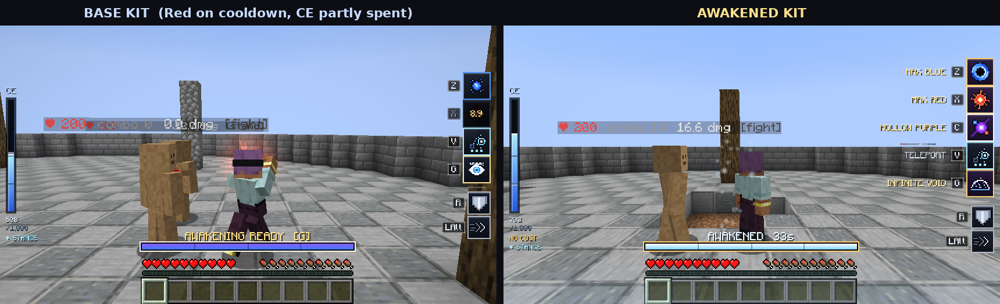

## Animation

Players are jointed and animated from data, JJS-style. The full reference is [docs/ANIMATION.md](docs/ANIMATION.md).

**Never stuck.** A held pose (a charge, a stance, a guard) belongs to something going on: a cast, a melee charge, a
guard, a clash or the player's own domain. If one is left showing with none of those for a second, the server releases
it and everyone's view of that player blends back to idle or movement; each client also lets go of a held pose its
server stopped backing (a missed packet), and an entity reloaded or respawned under the same id starts from a clean
pose. A cast that runs far past the length it declared (an end event that never came) is ended cleanly by the caster's
watchdog: its own cleanup, the pose released, the cooldown kept. Long actions such as clashes and open domains are
never cut short.

- **A real skeleton:**
  - 17 bones: root, hips, chest, neck, head, and shoulder/elbow/wrist and hip/knee/ankle on each side.
  - The skin, its overlays and armour are cut at the joints; at rest the model looks exactly like vanilla.
  - The root carries the whole body visually: it spins, dips and jumps without moving the hitbox.
- **Animations are JSON:**
  - One folder per character (`assets/jjk/animations/gojo/...`), plus shared poses; they hot-reload.
  - Gameplay only says `Anim.play(user, "rapid_heavy")`.
  - Keys go in ms, or in the reference GIF's own frame numbers. A key can pose some bones and leave the rest.
  - Easing per key or per bone: linear, ease in/out, step, overshoot or spring. Clips and poses mirror.
- **Layered playback:**
  - Base, lower-body, upper-body and head layers.
  - Priorities from idle up to ragdoll, and interrupt windows.
  - Authored blend times, with 0 meaning a hard cut onto an impact frame.
  - Holds, loops and playback speed.
  - Bones a clip leaves alone keep vanilla's walk and look.
  - Hit reactions (flinch, launch, knockdown, guard break) are clips too.
- **A debugger:**
  - `/jjkanim ui` gives play, pause, frame step, 0.25x–2x, restart and target.
  - A skeleton overlay shows joints, bone names and axes.
  - A readout shows time, frame, key, phase, blend, priority and layer.

Rapid Punches, Twofold Kick, Lapse Blue, Reversal Red, Hollow Purple and Infinite Void (Gojo), and Shutter Doors,
Fever Breaker, Lucky Volley, Jackpot and the Rhythm dance (Hakari), and Yuta's whole kit with Rika's, are keyed
frame by frame from the JJS GIFs. Their
contact frames sit on the ticks where the hits resolve. `tools/anim_ref.py` numbers a GIF's frames for that work.
Everything held in a fist (Blue, Red, Purple's two halves, Divergent Fist) follows the real hand through the elbow and
wrist.

The client tests:
- `AnimFrameworkClientTest` checks that every clip gameplay names exists, that the rig reproduces vanilla and bends
  the way its conventions say, and the blending, priority, loop and interrupt rules.
- The opt-in `PoseGalleryClientTest` renders exact clip frames for side-by-side comparison with the references.

## Visual tiers

Every technique has its own look, and power reads at a glance:

1. **Basic** — melee: thin swing arcs, sharp impact stars, crisp rings, small ripples. A hit flash holds at full
   strength for its first moments, so even a three-tick flash is seen.
2. **Base techniques** — Blue (a compact core with light spiralling *in*, arcs of light winding down into it), Red (a
   jittering core throwing spikes *out*, wind whipping round the finger, then a fireball with smoke rolling off it),
   Infinity (faint ripples where attacks stop), Teleport (space folds shut, snaps open).
3. **Awakening** — the reveal pillar and ground waves; Max Blue (event horizon, accretion disk, dark-blue ink, the
   world's light winding in) and Max Red (white wind turning red round his arm as it charges, red lightning,
   catastrophic blast, triple shockwave) as inward/outward equals.
4. **Hollow Purple, Unlimited Purple and Infinite Void** — the only effects with impact frames; Purple is
   awakening-only and lights the world magenta.

The effects are built from a small set of shapes:
- Light: glows, rings, beams and crisp shock shells. A shell is bright only at its silhouette, and the bigger it is,
  the fainter.
- Lightning bolts that re-fork every tick, so they crackle.
- Comet-tailed swirls: wind and energy whipping round a charge.
- Alpha-blended ink: dark energy and smoke, which additive light can't draw.
- A screen tint that holds while a technique lights the world.

The opt-in `FxGalleryClientTest` plays every one of the ~200 effects in front of a fixed camera, and Unlimited Purple
shot by shot, for comparing them.

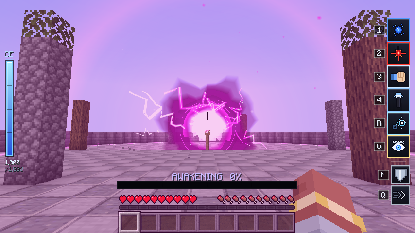

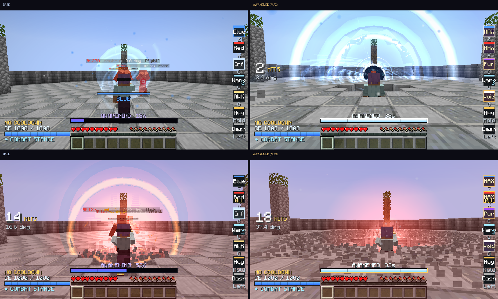

Effects fade when the camera is inside them, spawn fewer particles past 48 blocks, and small ones are sound-only past
96 blocks. `particleQuality` (0–3) in the client config scales every particle count.

## Opening a domain

A domain physically builds itself out of blocks, starting at the caster's feet: the ground spreads outward to the
outer ring, the walls rise and curve over into the ceiling, then the underground half seals and a pulse confirms it —
about two seconds, with a bright energy edge tracing the newest blocks. The barrier and sure-hit switch on only once
it is sealed. Everything replaced (including paintings and item frames inside) comes back exactly when it ends.

Every opening is presented: the caster gets a short cinematic (portrait, energy, the structure forming, then
"DOMAIN EXPANSION — INFINITE VOID"); nearby players see it build in their world with a light banner.

**Staying open:** a domain lasts its full duration whoever walks where. Its owner can step out and back in, and
victims can leave it (its sure-hit applies only inside), without collapsing it; it ends when it expires, when its owner
cancels it or dies, or when it loses a clash, and its structure is restored as always. (Authentic Mutual Love still
breaks at once if it opens on nobody.)

**Always ends:** no domain lasts forever. Whatever phase it is stuck in (forming, clashing, a clash that never
settles), it expires once its life passes its forming time + duration + a 60-second clash allowance, and never later
than 4 minutes (`domain.maxLifetimeTicks`, `domain.clashAllowanceTicks`).

**After a clash:** the winner runs by its own rules, however it got into the clash (countered while still forming, or
already open). Authentic Mutual Love plants its blades, and doesn't break as if it had opened on nobody. Idle Death
Gamble's reels run, paused through the clash itself and resumed after. Malevolent Shrine slices and Infinite Void
overloads whoever is inside. The same holds when a clash is called off or the other side vanishes mid-duel.

**Counter:** when someone nearby starts opening a domain and your Awakening meter is full, your Awakening key becomes
a counter for a moment — instant Awakening, your domain opens at once, a "DOMAIN EXPANSION VS DOMAIN EXPANSION" card
presents both of you, and the domains collide into the clash below. Miss the window and the key is a normal Awakening.

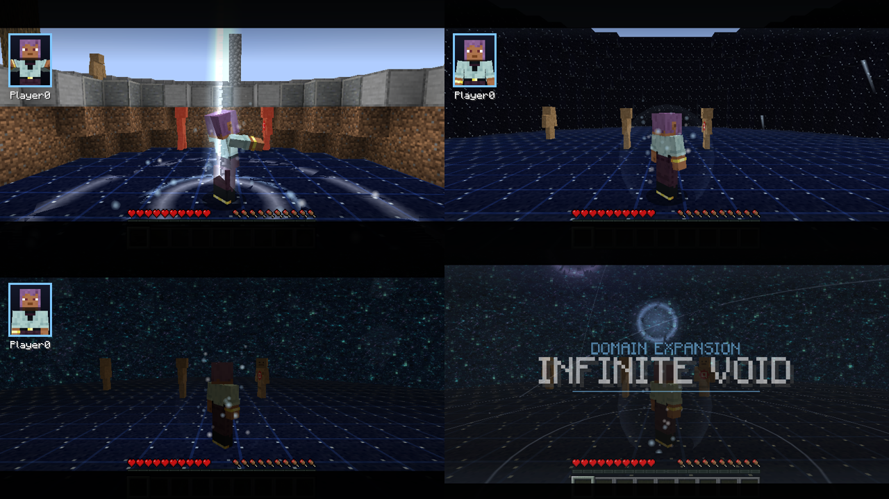
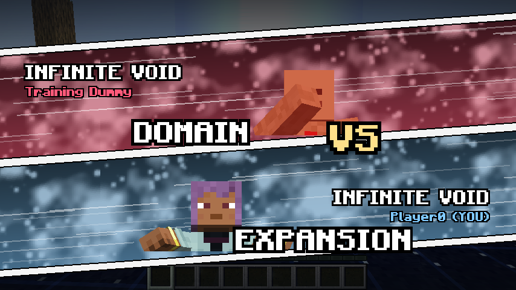

## Domain clashes

When two domains overlap they don't just fight on stats — the owners duel for control in a rhythm minigame. Both get
the same chart of prompts (← ↓ ↑ →, played with the arrow keys or A S W D). Each press is judged on timing
(PERFECT / GREAT / GOOD / MISS, windows configurable) and pushes a shared tug-of-war meter; streaks push harder (capped,
so consistency matters more than a lucky run). Every PERFECT sends an energy pulse out of the player through their
domain; misses make it flicker. Whoever holds the meter at the end — or drives it all the way across — wins.
Dead-even clashes go to sudden death. Domain strength, stats and who expanded first never decide it.

**Split territory.** During the clash both interiors are really there, side by side. The space is split down the
middle between the two centers: each side is built from its own domain's blocks and drawn with its own interior (the
Infinite Void's starfield on one side, Idle Death Gamble's white room and trains on the other), and each owner stands
on their side. Where the two spheres overlap their walls open up into one enclosed room. The boundary is driven by
the clash meter, so the side that plays better pushes it back; every PERFECT sends a pulse from the player's side into
the boundary. The rhythm lanes stay over the battle.

**Conquest.** When the duel is decided nothing swaps instantly: the winner's side sweeps across the loser's space over
about three seconds (50/50 → 60/40 → 75/25 → 90/10 → all of it), repainting it block by block. Then the loser's
domain ends, its space becomes the winner's territory (the barrier holds across all of it), and the winner's domain
carries on under its normal rules. When the winner's domain ends, the blocks of both are restored exactly.

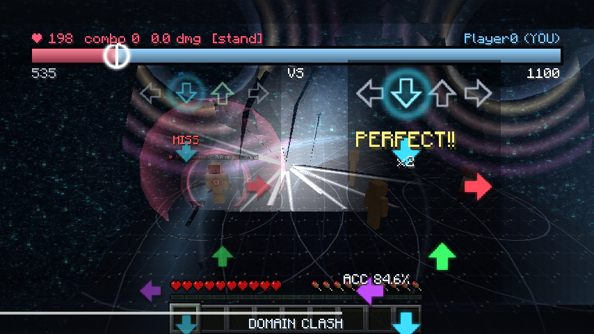
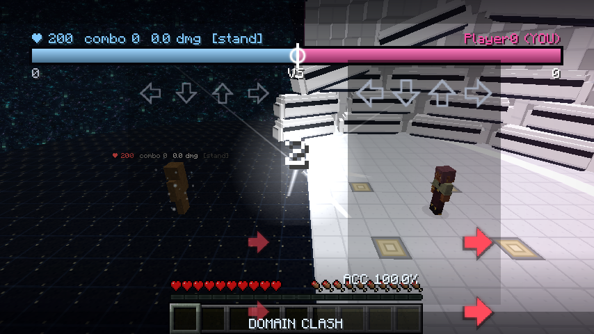
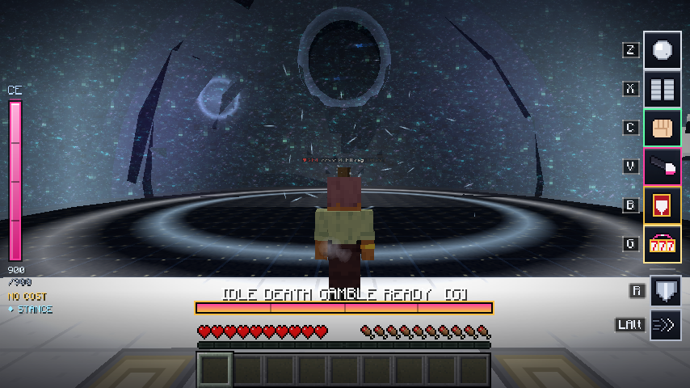

## Beam clashes

True Love Beam and Every Last Drop can meet head on, and so can two of the same: Yuta against Yuta, Ryu against Ryu.
What makes a clash is who fires the beams, never their kits; nobody ever clashes with their own beam. One session on
the server owns each clash from start to end.

**The counter.** The moment an ultimate beam starts charging, the server picks the one opponent who can answer it.
While it charges the window follows it: if nobody could answer when it began, whoever steps into its path gets it.
That is the closest who:

- stands in its path within reach;
- can see its source;
- is not in another clash;
- can act;
- has their own answering beam ready.

Ties go to the lower entity id. That player sees **PRESS [G]** from the first tick of the charge. Pressing their
Ultimate inside the window, which runs from the start of the charge until just after the beam fires, fires their beam
straight back after a short wind-up; answered early, it waits, held, for the charge to finish. Each charge can be
answered once; a press before the charge or after the window is an ordinary Ultimate. Every pairing works: Ryu
answers True Love Beam or another Every Last Drop with Every Last Drop, and Yuta answers either with True Love Beam.
If Yuta isn't awakened yet, a full meter turns True Love on in the same breath. Two such beams fired straight at each
other clash without a counter.

**The duel.** The first beam out is held a few blocks short of the answer still coming. When both are out they lock
onto one line, and a churning mass of both energies forms where they meet: each beam's colour on its own side, a
white heart, lightning and rings thrown off by every push. A beam that had already poured out more than half its
strength before the other met it is **overpowered on contact**: no struggle, straight to the breakthrough. Otherwise,
for about 10 seconds (twice the original length) each contestant gets skill checks: a needle sweeps round a dial, and
the space bar stops it. The same rules judge both sides whoever they are; nothing favours the one who fired first.

**The camera.** From the moment the beams meet until the breakthrough is over, both contestants watch from a distant
side-on shot that frames both fighters, both beams and the collision point (the dial sits over it). Nothing else takes
the view meanwhile. When the clash ends, is cancelled, or the player dies or disconnects, their own view comes back.

- **GREAT** (the thin gold arc at the zone's leading edge): +2.
- **GOOD** (the white arc): +1.
- **MISS**: -1.

The zone's position is random every time, and checks get faster as the clash goes on and the harder it presses. The
score difference moves the collision itself: the tug-of-war bar at the top of the screen is where the beams meet in
the world. The winning beam blazes and churns harder, and the losing one flickers.

**The outcome.** The winner's beam punches through the collision, the loser's collapses, and the loser takes the
winning beam plus the burst. On a tie both beams detonate together with balanced damage to each.

**Fairness and safety.**

- The server judges every press. The client reports how far round the needle was, and the server only believes it
  within what that player's round-trip time can explain.
- Bots judge their own checks on the server.
- Death, disconnecting, changing dimension, turning spectator, the beam being interrupted, or the server stopping
  ends the clash and releases both players. Their lock re-applies each tick, so it can never outlive the session.
- Everyone nearby sees the beams and the collision. Only the two contestants see their dials.

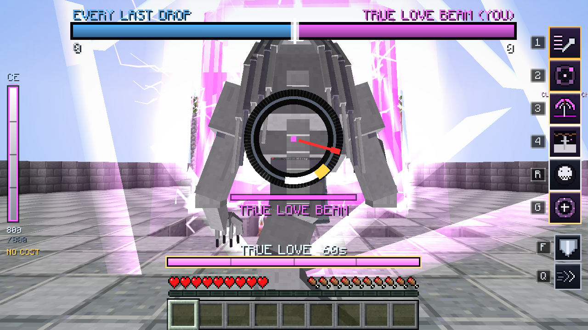
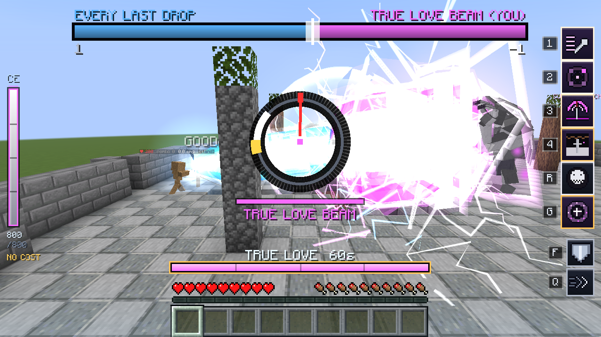
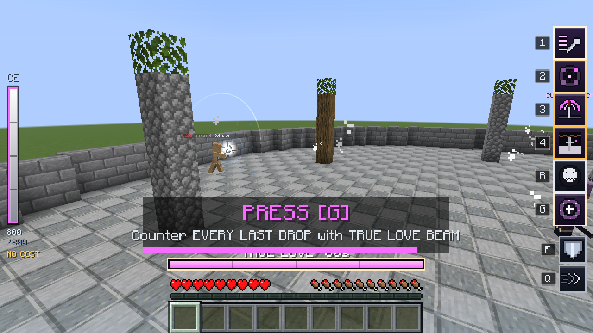

## Fall damage in fights

Height a move creates never turns into fall damage. Launched by a move (Shutter Doors, an uppercut, a juggle, a leap of
your own), only how far you land *below the point you were launched from* counts as a fall: thrown 20 blocks up and
landing back where you started, nothing; thrown 20 up and landing 10 blocks lower (30 in all), a 10-block fall. Being
juggled again in the air keeps the first launch point. The same goes for height a move gives without a push: a
teleport upward (Gojo's Teleport, a blink behind an airborne target, Energy Surge) counts from where you teleported
from, and anyone left in the air mid-move or mid-combo (casting, in hitstun, launched, spiked, hovering) counts from the
ground they last stood on. So Sukuna's Rush (knee, leap, slam) never hurts him or his victim on the way down. Ordinary
jumps and falls work as always.

## Temporary battle damage

Every block a technique destroys comes back exactly — state, container contents, the torch on it, the painting on
the wall, the sand that fell — three minutes after *that block* was damaged. Nothing drops, so nothing duplicates.
Player changes made in the meantime are kept (`restoration.conflictPolicy`). Pending restorations survive restarts.
Domain structures are separate and restore as soon as the domain ends. `/jjk restore status|now|forget`.

## Commands (op)

`/jjk arena` test arena with dummies · `/jjk dummy [stand|jump|fight] [n]` · `/jjk dummy domain <void|idg|shrine> [skill]` (solo clash practice: the nearest dummy opens that domain; press Awakening in the counter window to clash it; skill 0–1 is how well it plays) · `/jjk nocooldown true|false` ·
`/jjk awakening <amount>|end` · `/jjk reset` · `/jjk character gojo|hakari|yuji|yuta|none` · `/jjk domain cancel [all]` ·
`/jjk status [target]` · `/jjk config reload` · `/jjk kit ...` (Survival kit ownership, see Survival progression) ·
`/jjk mastery ...` · `/jjk incident ...` · `/jjk rifle ...` (see Investigations, curses and Mastery)

## Config

`config/jjk.json` holds every tunable (damage, cooldowns, costs, Awakening gain/drain/move costs, domain size/duration,
destruction limits, particle quality, screen effects, sound volume). `/jjk config reload` applies changes.

## Development

- `./gradlew build` — mod jar in `build/libs`
- `./gradlew runGameTest` — server GameTests (combat, techniques, Awakening, domain structure restore/crash recovery)
- `./gradlew runClientGameTest` — drives a real client through the whole kit with real input and takes screenshots
  (headless: run under Xvfb with Mesa; see `src/gametest` for the test-only headless mixin)
- `tools/roblox_sounds.py` rebuilds every sound from the Jujutsu Shenanigans audio (the Roblox IDs per move, fetched from
  Roblox or the JJS Skill Builder mirror at ossaamm.github.io, plus the wiki's jackpot sound); `tools/gen_textures.py`
  regenerates the textures
- `DomainCinematicClientTest` (opt-in, with `build/cinematic.txt` choosing the scenes) records every domain, both clashes
  and the True Love Beam into the camera with the game frozen and each tick drawn at several sub-tick moments;
  `tools/make_domain_cinematic.py` rebuilds that into a 60 fps film (a hook, the disclaimer cards, each scene, the beam
  out to white) and `tools/make_domain_soundtrack.py` scores it with the JJS soundtrack, each theme and hit landing on
  the picture's flashes. Mux them with ffmpeg: the film itself is silent.
